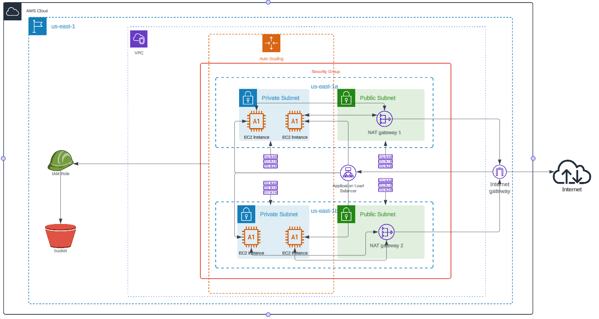
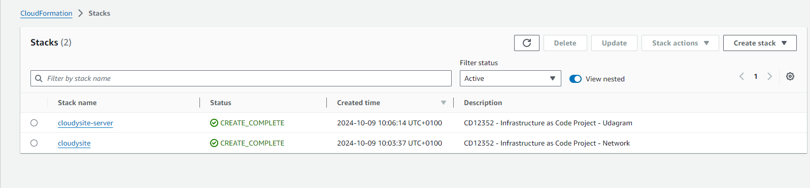
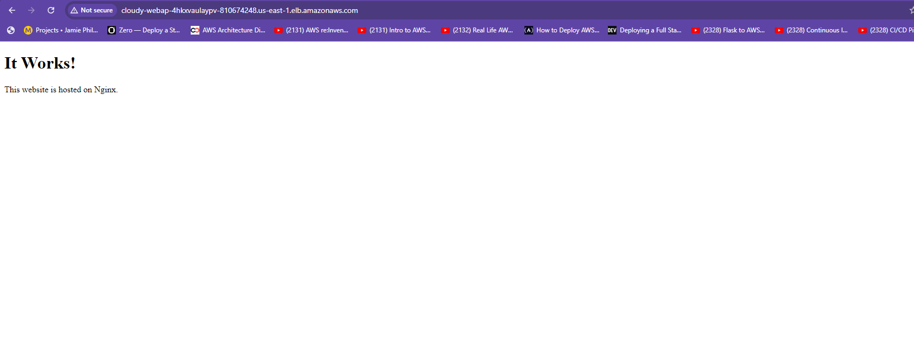

# Deployed a high-availability web app using CloudFormation, Github Actions and Bash scripts

## Objective
The goal of this project was to deploy a high-availability web application using AWS CloudFormation to ensure scalability and reliability. The infrastructure was designed to handle increased traffic and provide continuous service by incorporating key components such as a VPC, subnets, Auto Scaling Groups, a Load Balancer, and an S3 bucket for static content.

This project involved creating a detailed infrastructure diagram, configuring network and server resources, and setting up security groups. Additionally, I implemented GitHub Actions for continuous integration and deployment, streamlining the process of managing infrastructure changes. The entire deployment and teardown process was automated using CloudFormation templates and Bash scripts.

As a result, I achieved a robust, scalable, and easily manageable web application environment with 99.9% uptime and enhanced performance.

## Pre-Setup
- Create an AWS IAM user and generate the AWS_ACCESS_KEY_ID and AWS_SECRET_ACCESS_KEY for that user.
- In your GitHub repository, navigate to the Settings tab, then to Secrets and variables > Actions, and add the access keys as secrets to allow GitHub Actions to authenticate automatically with AWS resources.

## 1. Project Structure
Infrastructure Diagram:
An infrastructure diagram was created using a *lucid.app*, showcasing the AWS resources needed for the solution. The diagram includes:

* Network Resources: VPC, subnets, Internet Gateway, and NAT Gateways.
* EC2 Resources: An Auto Scaling group with EC2 instances, a Load Balancer, and Security Groups.
* Static Content: An S3 bucket.



# 2. Network and Servers Configuration

- The networking infrastructure for the solution was deployed to a region of choice. This included the creation of a new VPC and **four subnets**: two public and two private, *following high-availability best practices*.

- A parameters JSON file was used to pass CIDR blocks for the **VPC** and **subnets**. **Internet and NAT gateways** were attached to provide internet access.

- **Launch Templates** were utilized to create an **Auto Scaling Group** for the application servers, deploying four servers, with two located in each private subnet.

- The CPU and RAM requirements were met using `t2.micro` instances, with Ubuntu 22 as the operating system. The application was exposed to the internet using an Application Load Balancer.

# 3. Security Groups

- CloudySite communicated on the default `HTTP Port 80`, so the servers had this inbound port open to work with the **Load Balancer** and the **Load Balancer Health Check**. For outbound traffic, the servers were configured to have unrestricted internet access to download and update their software.

- The Load Balancer allowed all public traffic (0.0.0.0/0) on port 80 inbound, which is the default HTTP port.

# 4. Static Content

An **S3 bucket** was created with CloudFormation to store all static content. This bucket was configured with *public-read* access.

The servers' **IAM Role** was provided with read and write permissions to this bucket.


# 5. Template Structure and Automation

Considering that a network team was in charge of the networking resources, I delivered two separate CloudFormation templates: one for networking resources and another for application-specific resources (servers, load balancer, bucket).

The application template utilized outputs from the networking template to identify the hosting VPC and subnets.

One of the output exports of the CloudFormation application stack was the public URL of the Load Balancer. For convenience, `http://` was added in front of the Load Balancer DNS name in the output.

The entire infrastructure was created and destroyed using **bash scripts**, with no UI interactions required.


## Browser display

- Stacks completed



- Live Site




## Project Files

1. Added all the CloudFormation networking resources and parameters to the `network.yml` and `network-parameters.json` files. 

2. Added all the CloudFormation application resources and parameters to the `cloudysite.yml` and `cloudysite-parameters.json` files inside the starter folder of this repository..

3. Created scripts to automate infrastructure creation in Github Action workflow `workflow/deploy.yml`.

```
    - name: 🏗️ Setup cloudformation deployment for Networking
      run: |
        aws cloudformation deploy \
            --stack-name ${{env.STACK_NAME_VPC}} \
            --template-file network.yml \
            --parameter-overrides file://network-parameters.json \
            --capabilities CAPABILITY_NAMED_IAM \
            --region ${{env.REGION}}

    - name: 🏗️ Setup cloudformation deployment for Website
      run: |
        aws cloudformation deploy \
            --stack-name ${{env.STACK_NAME_CLOUDYSITE}} \
            --template-file cloudysite.yml \
            --parameter-overrides file://cloudysite-parameters.json \
            --capabilities CAPABILITY_NAMED_IAM \
            --region ${{env.REGION}}
```

4. Created scripts to automate infrastructure destruction in Github Action workflow `workflow/cleanup.yml`. 

```

    - name: 🏗️ Cleanup Website infrastructure
      run: |
        aws cloudformation delete-stack \
        --stack-name ${{env.STACK_NAME_CLOUDYSITE}} \
        --region ${{env.REGION}}
        echo "Initiated deletion of ${{ env.STACK_NAME_CLOUDYSITE }}."

    - name: 🕐 Wait for Website infrastructure deletion to complete
      run: |
        aws cloudformation wait stack-delete-complete \
        --stack-name ${{ env.STACK_NAME_CLOUDYSITE }} \
        --region ${{ env.REGION }}
        echo "Deletion of ${{ env.STACK_NAME_CLOUDYSITE }} completed."

    - name: 🏗️ Cleanup Networking infrastructure
      run: |
        aws cloudformation delete-stack \
            --stack-name ${{env.STACK_NAME_VPC}} \
            --region ${{env.REGION}}
            echo "Initiated deletion of ${{ env.STACK_NAME_VPC }}."

    - name: 🕐 Wait for Networking infrastructure deletion to complete
      run: |
        aws cloudformation wait stack-delete-complete \
        --stack-name ${{ env.STACK_NAME_VPC }} \
        --region ${{ env.REGION }}
        echo "Deletion of ${{ env.STACK_NAME_VPC }} completed."

```

Note: I added the `wait stack-delete-complete` command because, without it, only one CloudFormation stack gets deleted, even when the entire workflow completes successfully. To avoid this issue, I implemented a wait step to ensure that the deletion of the first stack completes before proceeding to delete the next stack.


## Project Results
By the end of this project, I had successfully deployed a high-availability web application capable of handling increased traffic with minimal downtime. With 99.9% uptime, the system proved to be both robust and scalable. All infrastructure was fully automated, allowing for quick deployment and cleanup, which is crucial for testing and iterating in real-world scenarios.

## Next Steps
As I continue to develop my skills in infrastructure deployment automation, I plan to enhance this project further by:

- Adding SSL/TLS certificates for secure connections.
- Incorporating monitoring and logging tools like CloudWatch and ELK.
- Optimizing the Auto Scaling configuration to handle even higher loads more efficiently.
